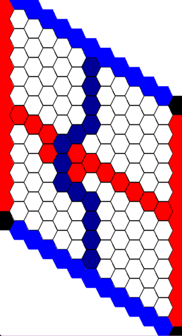
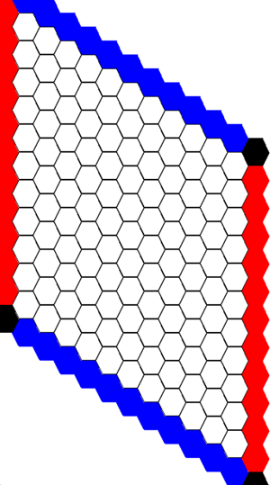

# Hex Board

> Its like a rhombus. but like. with hexes.



## Board Definitions

The HexBoard has two parts the [play area](#play-area) and the [end zones](#end-zones).
The game starts of as an [empty board](#empty-board) and each player takes turns claiming an empty space until one player [wins](../hex/Hex-Rules.md#end-game).

### Play Area

> I think there is a fancy mathematical expression I can use to define these coordinates. For now it will look like python code.

The play area is any `(x,y)` coordinates with `x in range [0,10]` and `y in range [0,10]`

#### Play area coordinates

```txt
 ___
/0,0\___
\___/1,0\___
/0,1\___/2,0\___
\___/1,1\___/3,0\___
/0,2\___/2,1\___/4,0\___
\___/1,2\___/3,1\___/5,0\___
/0,3\___/2,2\___/4,1\___/6,0\___
\___/1,3\___/3,2\___/5,1\___/7,0\___
/0,4\___/2,3\___/4,2\___/6,1\___/8,0\___
\___/1,4\___/3,3\___/5,2\___/7,1\___/9,0\___
/0,5\___/2,4\___/4,3\___/6,2\___/8,1\___/a,0\
\___/1,5\___/3,4\___/5,3\___/7,2\___/9,1\___/
/0,6\___/2,5\___/4,4\___/6,3\___/8,2\___/a,1\
\___/1,6\___/3,5\___/5,4\___/7,3\___/9,2\___/
/0,7\___/2,6\___/4,5\___/6,4\___/8,3\___/a,2\
\___/1,7\___/3,6\___/5,5\___/7,4\___/9,3\___/
/0,8\___/2,7\___/4,6\___/6,5\___/8,4\___/a,3\
\___/1,8\___/3,7\___/5,6\___/7,5\___/9,4\___/
/0,9\___/2,8\___/4,7\___/6,6\___/8,5\___/a,4\
\___/1,9\___/3,8\___/5,7\___/7,6\___/9,5\___/
/0,a\___/2,9\___/4,8\___/6,7\___/8,6\___/a,5\
\___/1,a\___/3,9\___/5,8\___/7,7\___/9,6\___/
    \___/2,a\___/4,9\___/6,8\___/8,7\___/a,6\
        \___/3,a\___/5,9\___/7,8\___/9,7\___/
            \___/4,a\___/6,9\___/8,8\___/a,7\
                \___/5,a\___/7,9\___/9,8\___/
                    \___/6,a\___/8,9\___/a,8\
                        \___/7,a\___/9,9\___/
                            \___/8,a\___/a,9\
                                \___/9,a\___/
                                    \___/a,a\
                                        \___/ 
```

> Its Hex Duh. If you're doing coordinates the wrong way get out your note pad.

The hexes with x or y values of 10 are just "a" because it looks prettier. These are only the playable hexes and there is a boarder around for the end zone. For the sake of the game these will be left out of the board.

#### Empty space

Empty spaces are white and aren't yet claimed by a player.
On each turn a player will claim an empty space and convert it to their player space.

##### Empty space pathfinding

In path finding an empty space can be used by any player and costs 1 to use.

#### Player space

A player space is a hex that has been claimed by a player on a previous turn.
It has the same colour as their team colour.

##### Player space pathfinding

When pathfinding, a player space has a different behaviour based on which player is doing the pathfinding.
If the owning player is pathfinding then the player space is available for use and costs 0 to use.
Inside the pathfinding algorithm, player spaces, when used, have a depth of 0.5 more that its [empty space] parent.
Even though they have the same cost as their parent, they have a different depth to force the pathfinding agent to explore the entire set of connected player spaces before moving on to other empty spaces.

### End Zones

There are four end zones on the four edges of the play area.
Two for each player.
Each player's end zones are opposite of each other.
Blue has the top and bottom end zones.
Red has the left and right end zones.

#### End zone coordinates

Player | Edge | Coordinate Range
--|--|--
Blue | Top | `{(0, -1) .. (10,-1)}`
Blue | Bottom | `{(0,11) .. (10,11)}`
Red | Left | `{(-1,0) .. (-1,10)}`
Red | Right | `{(11,0) .. (11,10)}`

### Empty board

Each game starts with an empty board.
An empty board has the entire playable area set as empty spaces.
The end zones are always set for each player and never change between and within games.


